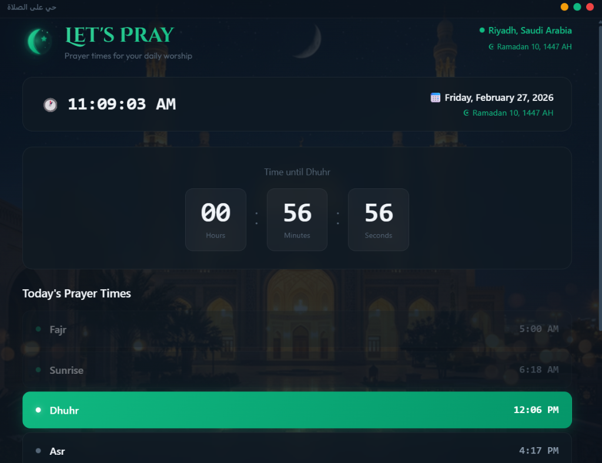
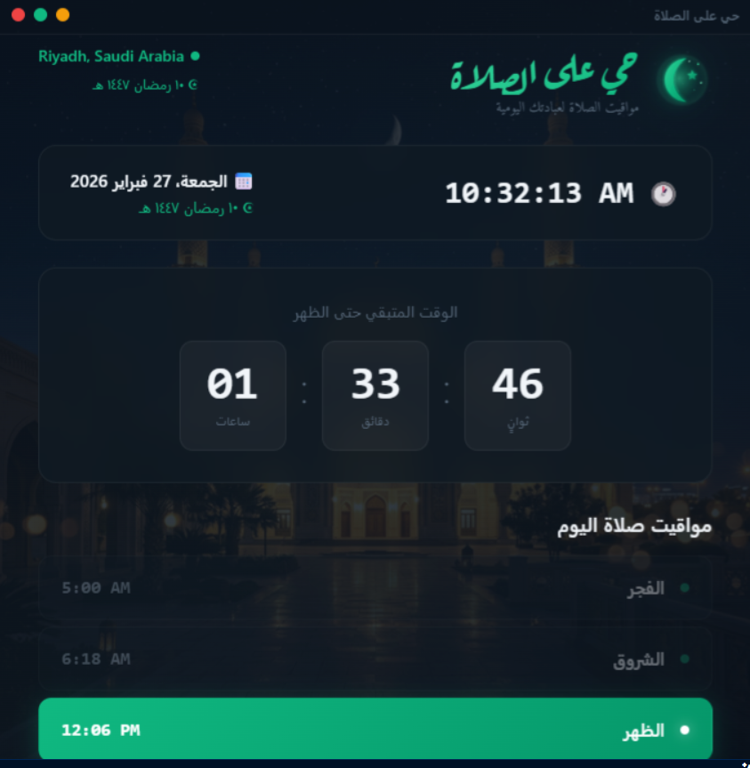

# Let'sPray (حي على الصلاة)




A beautifully crafted Desktop Prayer Times & Azan Application built with modern web technologies. **Let'sPray** automatically detects your location, provides precise prayer time calculations using `adhan.js`, and plays customized authentic Azan sounds directly from your desktop.

## ✨ Features

- **Automatic Location Detection**: Accurately fetches your city and coordinates, with manual override and specific Saudi Arabia city coverage (including Al Khobar, Dammam, Dhahran).
- **Offline Azan Audio**: Includes high-quality built-in MP3 files of famous Muezzins (Mishary Alafasy, Abdul Basit, Al-Sudais, etc.). 
- **System Integrations**: 
  - Minimize to System Tray (with high-res Hilal logo).
  - Native desktop notifications for prayer times.
  - Startup launch support.
- **Beautiful UI**: Glassmorphic, dark-mode focused, elegant Arabic Calligraphy (`Aref Ruqaa`, `Amiri`) and English typography (`Cinzel Decorative`, `Outfit`), fully responsive with animations.
- **Full Localization**: Seamless RTL (Right-to-Left) Arabic support and LTR English support. 
- **Advanced Calculation Methods**: Customize your calculation method (Umm al-Qura, ISNA, MWL, etc.), Madhab, and high-latitude rules. Includes per-prayer manual offset adjustments (+/- minutes).

## 🚀 Tech Stack

- **Electron**: Cross-platform native desktop integration.
- **React 18 + Vite**: Lightning-fast, component-based UI rendering.
- **Adhan.js**: Accurate astronomical prayer time calculations.
- **Tailwind CSS**: Rapid and robust styling.
- **i18next**: Robust internationalization framework.

## 🛠 Installation & Development

### Options 1: Download Release
Head over to the [Releases](https://github.com/Jalal-Nasser/LetsPray/releases) page to download the latest `.exe` installer.

### Option 2: Build From Source

1. **Clone the repository:**
   ```bash
   git clone https://github.com/Jalal-Nasser/LetsPray.git
   cd Azan
   ```

2. **Install dependencies:**
   ```bash
   npm install
   ```

3. **Start the development server:**
   ```bash
   npm run dev
   ```

4. **Package for distribution (Windows):**
   ```bash
   npm run build
   npm run package
   ```

## 📬 Feedback & Contributions

- Issues & Feature Requests: Please use the [GitHub Issues](https://github.com/Jalal-Nasser/LetsPray/issues) tab.
- Pull requests are welcome!

## 📜 License

© 2026 mDeploy. All rights reserved. 
Developed by Jalal Nasser.
